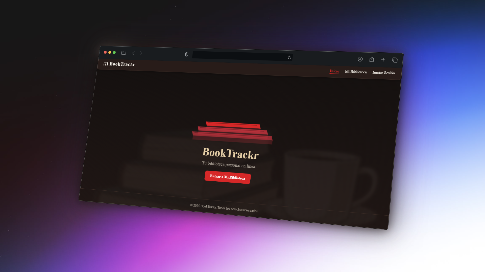
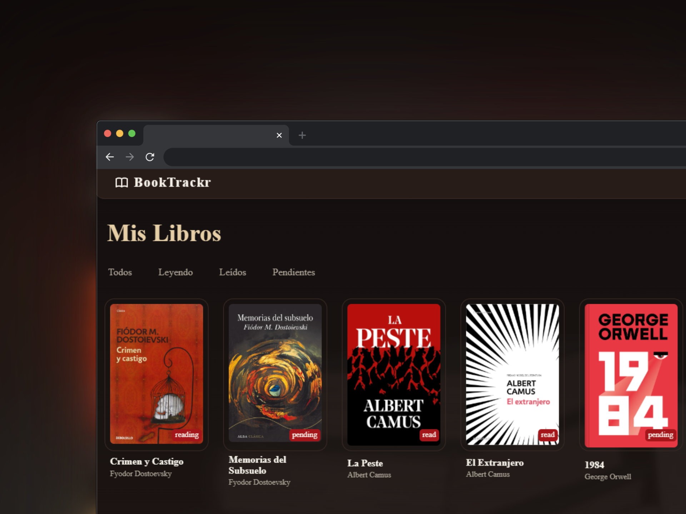

# 📚 BookTrackr

> **Tu biblioteca personal online.** Una aplicación web para registrar, organizar y gestionar tus lecturas favoritas, con un estilo clásico inspirado en las bibliotecas vintage.

  
  

**BookTrackr** es una plataforma que te permite llevar el control de tus libros leídos, pendientes o en curso, y guardar notas o frases que te hayan marcado.  
El objetivo es ofrecer una experiencia cálida y minimalista, centrada en la lectura y el desarrollo personal.

Este proyecto se desarrolla en paralelo al **bootcamp Full Stack de [midudev](https://github.com/midudev/jscamp)**, aplicando cada tecnología aprendida módulo a módulo.

## 🎯 Objetivos y Características

- ✨ Registro y gestión de libros (leído, leyendo, pendiente).
- 📝 Notas o frases personales por libro.
- 🔍 Filtros por estado o género.
- 📚 Estilo visual **vintage tipo biblioteca clásica**.
- 💾 Persistencia de datos local y, posteriormente, con base de datos SQL.
- 🔐 Sistema de usuarios.

## 🛠️ Tecnologías

- 00 - HTML & CSS
- 01 - JavaScript
- 02 - React
- 03 - Estado Global y React Router
- 04 - Node.js
- 05 - TypeScript
- 06 - SQL
- 07 - CI/CD
- 08 - Docker

## 🎨 Diseño

- 👉🏻 [Ver diseño del proyecto](https://stitch.withgoogle.com/projects/10756088116725934991)

## 📜 Licencia

Este proyecto se distribuye bajo la licencia **MIT**.  
Podés usarlo, modificarlo y compartirlo libremente, citando al autor.

## 👤 Autor

Desarrollado con ❤️ por **Juan Bautista Malina**.

- 🌐 [Portfolio](https://juanbautistamalina.github.io/portfolio/)
- 💻 [GitHub](https://github.com/juanbautistamalina)
- 💼 [LinkedIn](https://www.linkedin.com/in/juan-bautista-malina/)

---

> _“Un libro leído es una historia vivida dos veces.”_ 📖
