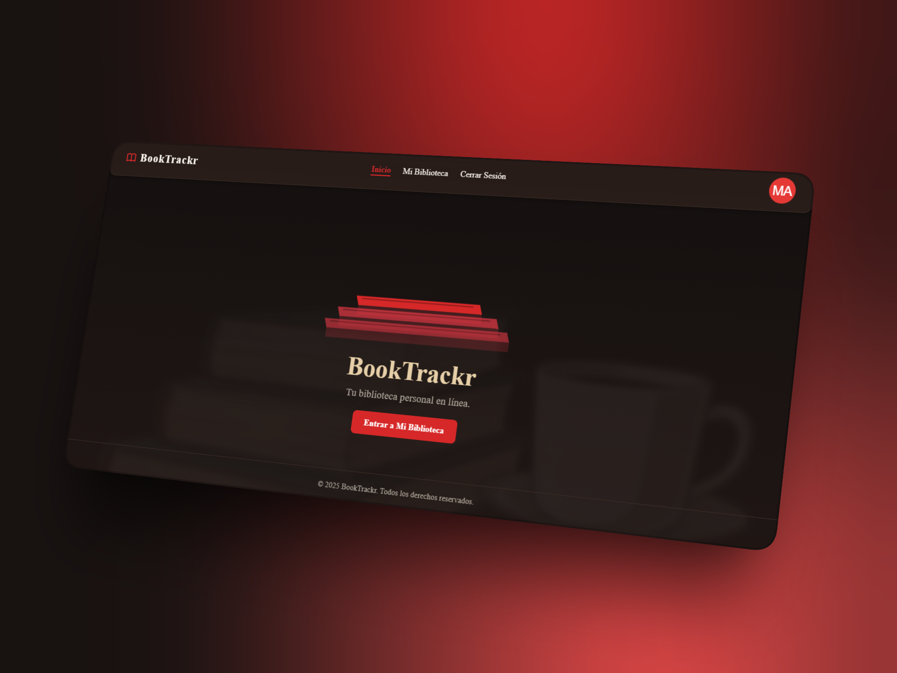
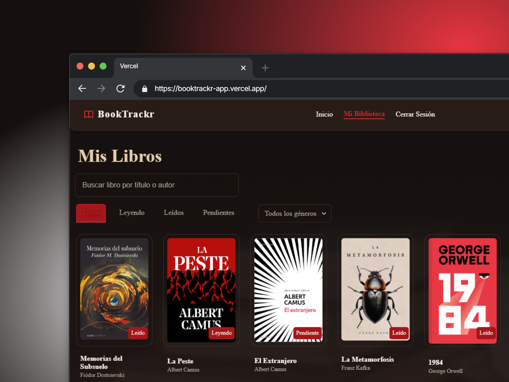

# 📚 BookTrackr

> **Tu biblioteca personal online.** Una aplicación web para registrar, organizar y gestionar tus lecturas favoritas, con un estilo clásico inspirado en las bibliotecas vintage.

  
  

**BookTrackr** es una plataforma que te permite llevar el control de tus libros leídos, pendientes o en curso, y guardar notas o frases que te hayan marcado.  
El objetivo es ofrecer una experiencia cálida y minimalista, centrada en la lectura y el desarrollo personal.

Este proyecto se desarrolla en paralelo al **bootcamp Full Stack de [midudev](https://github.com/midudev/jscamp)**, aplicando cada tecnología aprendida módulo a módulo.

## 🎯 Características

- 🔐 Sistema de registro e inicio de sesión con autenticación JWT
- ✨ Registro y gestión de libros con estados: leyendo, leído y pendiente
- 🖼️ Portada personalizada por libro (subida desde tus archivos)
- 📝 Notas personales por libro
- 🔍 Filtros por estado y género literario
- 👤 Avatar único generado automáticamente para cada usuario
- 📱 Diseño responsive para móvil y escritorio
- 📚 Estilo visual **vintage tipo biblioteca clásica**

## 🛠️ Tecnologías

### Frontend

### Backend

### Base de datos

### Deploy

## 📜 Licencia

Este proyecto se distribuye bajo la licencia **MIT**.  
Podés usarlo, modificarlo y compartirlo libremente, citando al autor.

## 👤 Autor

Desarrollado con ❤️ por **Juan Bautista Malina**.

- 🌐 [Portfolio](https://juanbautistamalina.github.io/portfolio/)
- 💻 [GitHub](https://github.com/juanbautistamalina)
- 💼 [LinkedIn](https://www.linkedin.com/in/juan-bautista-malina/)

---

> *"Una habitación sin libros es como un cuerpo sin alma."*